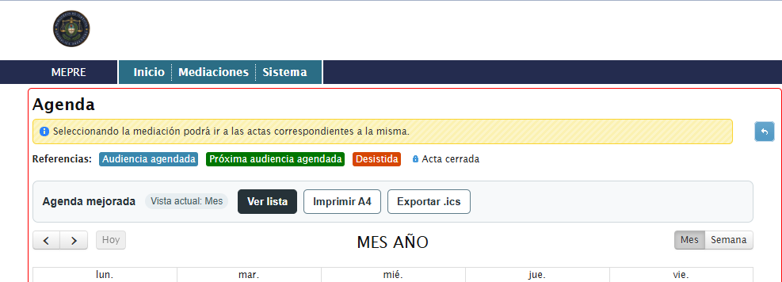
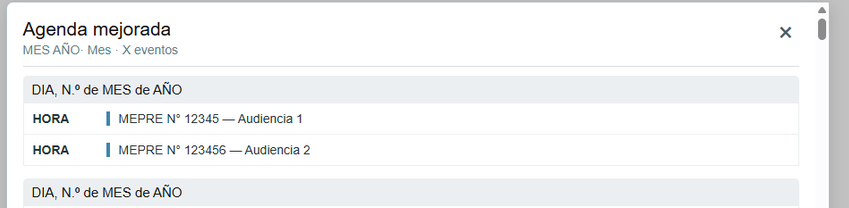
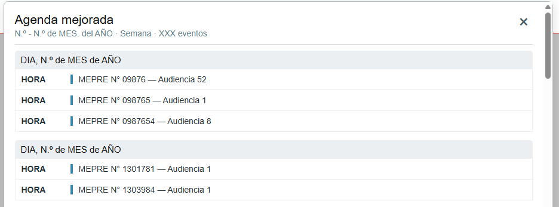
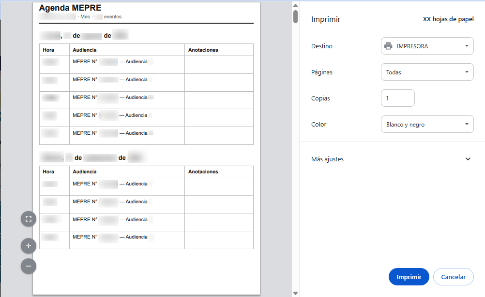

# MEPRE Agenda Mejorada

Extensión de Chrome que mejora la visualización y gestión de la agenda del sistema MEPRE.

Permite visualizar las audiencias en un formato más claro, imprimir la agenda en A4 y exportar los eventos a formato `.ics` para utilizarlos en Google Calendar u otros calendarios compatibles.

Actualmente soporta las vistas **Mes** y **Semana** de MEPRE.

## Funcionalidades

- Vista de agenda mejorada y ordenada por día y hora.
- Compatibilidad con las vistas **Mes** y **Semana**.
- Impresión optimizada para A4.
- Espacio para anotaciones en la versión impresa.
- Exportación de eventos a `.ics`.
- Conservación de horario de inicio y fin cuando MEPRE lo proporciona.
- Detección automática de la vista activa.
- Procesamiento completamente local en el navegador.
- Sin backend ni envío de datos a servidores externos.

## Vista previa



### Vista mensual



### Vista semanal



### Impresión A4



> Las capturas utilizadas en este repositorio contienen datos ficticios.

## Instalación

1. Descargar o clonar este repositorio.
2. Abrir Chrome.
3. Ir a:

   `chrome://extensions`

4. Activar **Modo de desarrollador**.
5. Seleccionar **Cargar descomprimida**.
6. Elegir la carpeta del proyecto.
7. Abrir MEPRE normalmente.
8. Ingresar a **Ver Agenda**.

Sobre el calendario aparecerá la barra **Agenda mejorada**.

## Uso

La extensión agrega tres acciones principales:

### Ver lista

Muestra las audiencias de la vista actual en un formato más grande y legible, agrupadas por fecha y ordenadas por horario.

### Imprimir A4

Genera una versión limpia de la agenda actual preparada para impresión.

La impresión se realiza dentro de la propia página y no requiere habilitar ventanas emergentes.

### Exportar .ics

Genera un archivo `.ics` con los eventos actualmente visibles.

El archivo puede importarse en:

- Google Calendar
- Apple Calendar
- Microsoft Outlook
- Otros calendarios compatibles con iCalendar

## Google Calendar

Después de seleccionar **Exportar .ics**:

1. Abrir Google Calendar.
2. Ir a **Configuración**.
3. Seleccionar **Importar y exportar**.
4. Importar el archivo generado por la extensión.
5. Seleccionar el calendario de destino.

> La exportación `.ics` no constituye una sincronización permanente.  
> Si una audiencia cambia posteriormente en MEPRE, es necesario volver a exportar e importar la agenda.

## Cómo funciona

MEPRE utiliza una versión antigua de FullCalendar para representar las audiencias.

La extensión agrega una capa sobre la interfaz existente sin modificar el funcionamiento original del sistema.

Para obtener los eventos utiliza diferentes estrategias según la vista activa:

- **Mes:** reconstruye fechas y horarios utilizando el calendario renderizado por FullCalendar.
- **Semana:** utiliza el rango semanal visible y las columnas del calendario para asociar cada audiencia con su fecha correspondiente.

La comunicación entre el contexto de MEPRE y la extensión se realiza mediante un pequeño bridge ejecutado en la página.

## Arquitectura

Los principales archivos son:

```text
bridge.js
    Comunicación con el contexto JavaScript de MEPRE.

content.js
    Extracción de eventos, generación de agenda, impresión y exportación ICS.

styles.css
    Interfaz de la extensión y estilos de impresión.

manifest.json
    Configuración de Chrome Extension (Manifest V3).
```

## Tecnologías

- JavaScript
- Chrome Extensions Manifest V3
- DOM APIs
- FullCalendar
- iCalendar / ICS
- CSS Print
- ASP.NET WebForms compatibility

## Importante

El archivo .ics es una exportación, no una sincronización permanente. Si luego cambia una audiencia en MEPRE, hay que volver a exportar/importar.

## Privacidad

La extensión funciona completamente de forma local. Sólo tiene permiso para https://www2.jus.gov.ar/mepre/* y no solicita permisos adicionales.

## Versión actual

**v1.2.2**

El historial completo de cambios está disponible en [CHANGELOG.md](CHANGELOG.md)

## Motivación

Este proyecto nació para resolver un problema real de uso diario.

La agenda original de MEPRE permite consultar las audiencias, pero su visualización e impresión pueden resultar poco prácticas.

La extensión busca mejorar esa experiencia sin reemplazar MEPRE, modificar sus datos ni requerir infraestructura adicional.